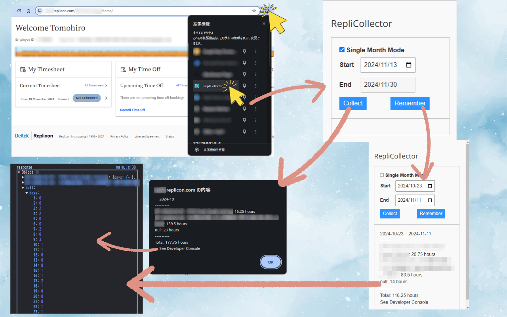

# RepliCollector

## Overview

This chrome extension is for collecting and remembering the working hours in Replicon.

## How to Install

1. Download or Clone this repository, and unzip it if necessary.
2. Go to `chrome://extensions/`, and enable `Developer mode`.
3. Push `Load unpacked` button, and select the `src` folder in the unzipped folder.

## How to Use

### Collect

1. Go to `https://*.replicon.com/` and login.
2. Push the extension icon then the popup will appear.
3. Input the target year and month, and push the `Collect` button.
4. Wait until the data is collected while several popups appear and disappear.
5. The data will be shown in alert and in the Devtools Console.

### Remember

1. Go to `https://*.replicon.com/` and login.
2. Push the extension icon then the popup will appear.
3. Input the target year and month, and push the `Remember` button.
4. The data will be shown in popup and in the Devtools Console.

## Future Work

- [ ] export data to csv
- [ ] collect data from multiple months
